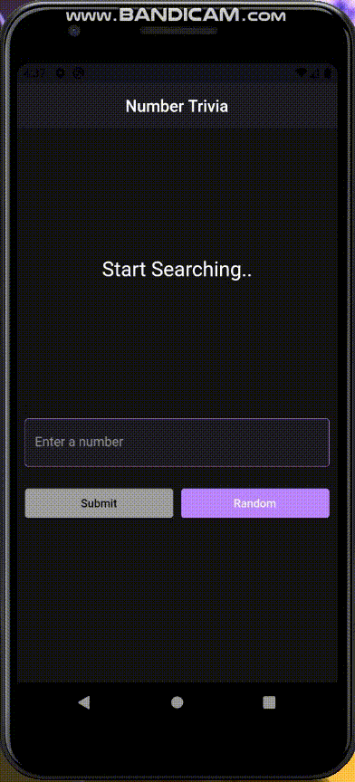

# Number Trivia

A Flutter Application to learn interesting facts about numbers.

For development of the application, Test Driven Development + Clean Architecture practice given by <b>Reso Coder</b> is followed. Bloc is used for state management.

## Demo

